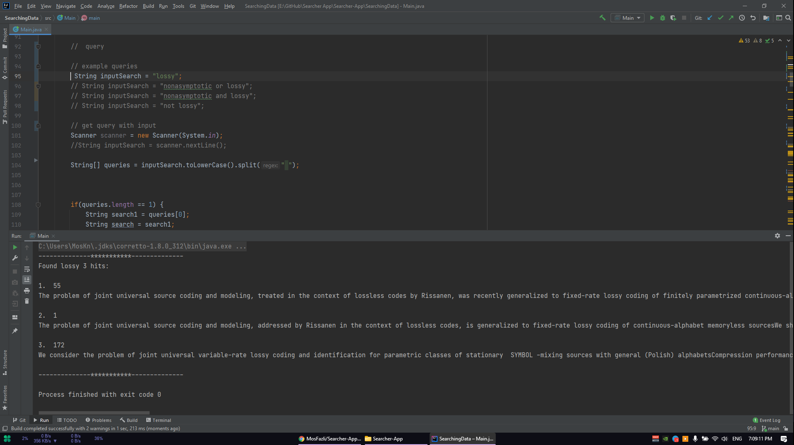

# Searcher App
Searching Text into the database
This program is implemented in Java and uses the Lucene library (version 8.9.0).

In this code, folder 0 is a number of text files that have been collected from the arxiv site and have an abstract and introduction, as input to the program. Then indexing based on these files begins.
You can also change the address of the input folder or fileread function as you wish so that you can give the files you want to the program the way you want.
* Not all stop words have an effect on the result.
* The indexing process is very efficient and fast and takes up little memory.
* The program is not case sensitive.
* You can search for different query modes such as one-part queries, two-part queries with not, three-part queries with subscriptions, and community collections.

If you have a question or comment, please share it with me.

این برنامه با زبان جاوا پیاده سازی است و در آن از کتابخانه Lucene (نسخه8.9.0) استفاده شده است.

در این کد، فولدری 0تعدادی فایل تکست که از سایت arxiv جمع اوری شده اند و دارای قسمت چکیده و مقدمه هستند، به عنوان ورودی به برنامه داده می شود. سپس ایندکس کردن بر اساس این فایل ها شروع می‌شود.
شما نیز می توانید به دلخواه آدرس فولدر ورودی یا تابع fileread را تغییر دهید تا بتوانید فایل های موردنظر خود را به طریقه دلخواه خود به برنامه بدهید.
* تمامی stop words در نتیجه تاثیری نمی گزارند.
* فرآیند ایندکس کردن بسیار بهینه و سریع انجام شده و حافظه کمی می گیرد.
* برنامه نسبت به حروف بزرگ و کوچک حساس نیست.
* می‌توانید حالات مختلف کوئری نظیر کوئری های یک بخشی، دو بخشی با not، سه بخشی با اشتراک و اجتماع مجموعه ها را جستجو کنید.

اگر سوال یا نظری داشتید لطفا آن را با من به اشتراک بگذارید.
